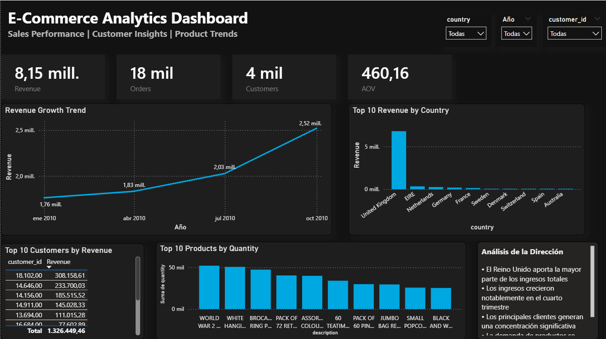

# E-Commerce Analytics Dashboard

Interactive business intelligence dashboard built using PostgreSQL, Python, and Power BI.

## Tools Used
- PostgreSQL
- pgAdmin
- Python (Pandas)
- Power BI
- GitHub

## Project Overview

This project analyzes e-commerce transactional data to identify:

- Revenue trends over time
- Top countries by sales
- Highest value customers
- Best-selling products
- Average Order Value (AOV)

## Dashboard Preview


## Key KPIs

- Revenue: 8.15M
- Orders: 18K
- Customers: 4K
- AOV: 460.16

## Files

- `sql/` SQL queries
- `powerbi/` Dashboard
- `notebooks/` Python cleaning
- `Data/` Dataset
# 🛒 E-Commerce Analytics Dashboard

# 🛒 Dashboard de Analítica E-Commerce

---

## 📊 Overview | Descripción General

**EN:**
This project analyzes e-commerce transaction data to uncover key insights about revenue, customers, and product performance. It simulates a real-world business intelligence workflow using SQL, Python, and Power BI.

**ES:**
Este proyecto analiza datos de transacciones de e-commerce para identificar insights clave sobre ingresos, clientes y desempeño de productos. Simula un flujo real de inteligencia de negocios utilizando SQL, Python y Power BI.

---

## 🚀 Key Insights | Principales Insights

**EN:**

* Revenue shows consistent growth over time
* The United Kingdom generates most of the revenue
* A small group of customers contributes a large share of sales
* Product demand is concentrated in a few top-performing items

**ES:**

* Los ingresos muestran un crecimiento sostenido en el tiempo
* Reino Unido concentra la mayor parte de los ingresos
* Un grupo reducido de clientes genera gran parte de las ventas
* La demanda se concentra en pocos productos de alto rendimiento

---

## 🛠 Tech Stack | Tecnologías Utilizadas

* **SQL** – Data extraction & KPI calculation | Extracción de datos y cálculo de KPIs
* **Python (Pandas)** – Data cleaning & transformation | Limpieza y transformación de datos
* **Power BI** – Dashboard & visualization | Visualización y dashboard

---

## 📂 Project Structure | Estructura del Proyecto

```text
ecommerce-analytics/
│
├── images/        # Dashboard preview | Vista previa
├── notebooks/     # Data cleaning (Python) | Limpieza de datos
├── sql/           # Analysis & KPIs | Análisis y KPIs
├── powerbi/       # Power BI dashboard
├── README.md
└── .gitignore
```

---

## 📸 Dashboard Preview | Vista del Dashboard



---

## 💡 Business Value | Valor de Negocio

**EN:**
This dashboard helps identify revenue drivers, understand customer behavior, and evaluate product performance to support data-driven decisions.

**ES:**
Este dashboard permite identificar los impulsores de ingresos, entender el comportamiento de los clientes y evaluar el rendimiento de productos para apoyar decisiones basadas en datos.

---

## ⚠️ Note | Nota

**EN:** Raw datasets were excluded to optimize repository performance and follow best practices.
**ES:** Los datasets originales no se incluyen para optimizar el repositorio y seguir buenas prácticas.

---

## 👩‍💻 Author | Autora

**Valeria Villegas**
